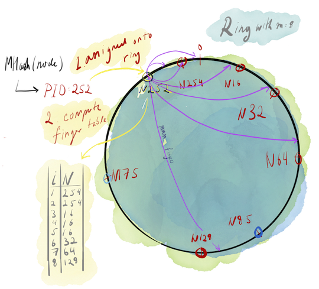
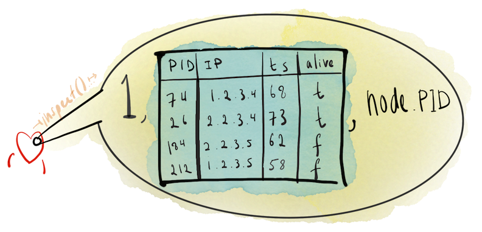
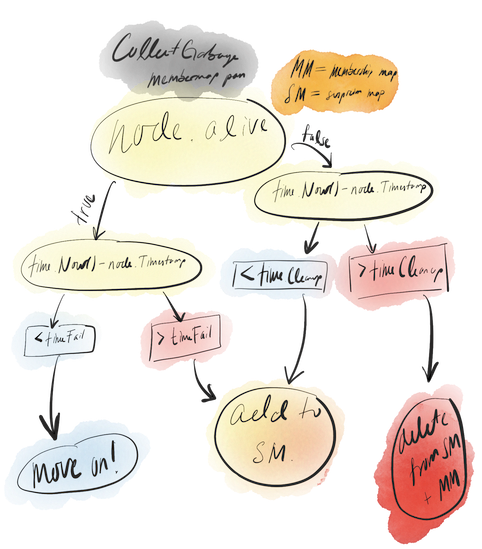
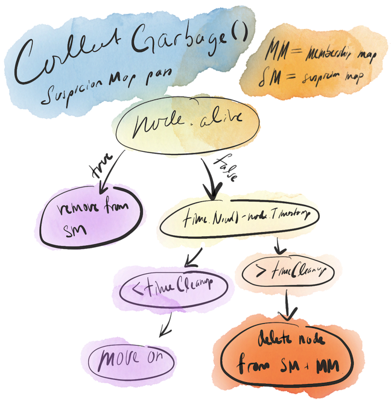

# Chord-ish 

A play implementation of the Chord protocol as described in [this paper](https://pdos.csail.mit.edu/papers/ton:chord/paper-ton.pdf) for use as the membership and failure detection layers for [*Chord-ish DeFiSh*](https://github.com/slin63/chord-dfs).

## Setup

1. `docker-compose build && docker-compose up --scale worker=<num-workers>`
   1. For `num-workers`, it's stable for 3 - 5 workers. You can scale to as many nodes as you want though; if you don't mind Docker eating all your CPU.

## Chord-ish, briefly

### Membership & Failure Detection

In any distributed system there needs to be some way of knowing what other nodes (machines / processes) are members within a group. A *membership layer* achieves that by implementing some protocol that provides a consistent view of memberships within that group, thereby allowing nodes to discover and communicate with one another.  

Also, as in any distributed system, failures are inevitable. Consequently, membership layers need to also be able to adapt to unexpected changes in membership. This requires a failure detection component, assigned with the task of detecting node failures or crashes. 

### Introducing, Chord-ish

To fill the role of the *membership* and *failure detection* layers for my highly convoluted and inefficient distributed key/value store, [Chord-ish DeFiSh](https://github.com/slin63/chord-dfs).  I decided to ~~implement~~ bastardize *[Chord](https://pdos.csail.mit.edu/papers/ton:chord/paper-ton.pdf)*. 

Why did I do this instead of building something way simpler, such as an [all to all, all to one, or barebones gossip membership protocol](https://courses.engr.illinois.edu/cs425/fa2014/L4.fa14.pdf)? Because I saw Chord in a [UIUC-CS425](https://courses.physics.illinois.edu/cs425/fa2019/) lecture on peer-to-peer systems and thought it sounded really cool.

Many features were stripped out and many poor decisions were made, and my following description of the protocol will be specific to my usage of it and *should not* be trusted under any circumstances. I'll use the name *Chord-ish* to identify my implementation.

Let's begin!

### Consistent Hashing, Finger Tables, & Membership Tables

First, some definitions and context. 

*Consistent hashing* is the process by which a hash function is used to distribute *K* objects across *N* points on a virtual ring, where *N = 2<sup>m</sup> - 1*. Here, *m* is an arbitrary constant that can be made larger or smaller, correlating directly with the expected number of nodes that the protocol will be supporting. 

Why is this useful? Let's say that we have a distributed key/value store that assigns server positions and key/value assignments with the following formulas: 

```go
assignedPoint := hash(IPAddr) % (Number of servers)
assignedServer := hash(key) % (Number of servers)
```

Servers and key/value pairs are still evenly distributed here, yes, but if the number of servers is ever changed for something like a horizontal up or downscale, downtime is needed to rehash nodes and key/value pairs on to newly evaluated `assignedPoints` and `assignedServers`. Consistent hashing assigns inputs to points using a function that is independent of the total number of node within a group, meaning we can scale up or down without needing downtime to rehash.

Chord-ish works by using a *consistent hashing* function to assign the IP addresses (or any unique identifier) of an arbitrary number of nodes onto a virtual ring with 2<sup>m</sup> - 1 points. Consistent hashing ideally distributes all nodes evenly across the ring, which leads to some built-in load-balancing which can be useful when using Chord-ish's node's as key/value stores, as we do in Chord-ish DeFiSh. 

Chord-ish's consistent hashing function is implemented in `/internal/hashing`.

```go
func MHash(address string, m int) int {
  // Create a new SHA1 hasher 
  h := sha1.New() 
  
  // Write our address to the hasher
  if _, err := h.Write([]byte(address)); err != nil {
    log.Fatal(err)
  }
  b := h.Sum(nil)

  // Truncate our hash down to m bits.
  pid := binary.BigEndian.Uint64(b) >> (64 - m)

  // Convert to an integer to get our ring "point", which
  // doubles as our process/node ID.
  return int(pid)
}
```

After a node is assigned onto the ring, it generates a *finger table*. Finger tables are Chord-ish's routing tables, key/value maps of length *m* where the corresponding keys and values are as follows

- `key = some integer i ranging from (0, m)`
- `value = (first node with PID >= (currentNode.PID + 2**(i - 1)) % (2**m))` where `a**b` = *a<sup>b</sup>*.
  - The ` … % (2 ** m)` is important here. If some calculated value exceeds 2<sup>m</sup>-1, then this module operator "wraps" the calculated value back around the virtual ring. For an example, look at the visualization of the finger table calculations (the blue arrows) in the figure below.

Finger tables are used in canonical Chord to enable *O(log n)* lookups from node to node, but because Chord-ish won't actually be doing any storing of its own, finger tables here are only used to disseminate heartbeat and graceful termination messages. Doesn't that defeat the purpose of going through all the trouble of implementing Chord? Haha! Yes. No one's paying me to do this so I can do a bad job if I want. Not that I wouldn't do a bad job if someone was paying me, either.

Besides finger tables, the other essential piece of state held by each node is a *membership map*. Membership maps are described as follows:

```go
// memberMap maps a node's PID to information about that node.
var memberMap = make(map[int]*MemberNode)
type MemberNode struct {
  IP        string      
  Timestamp int64  // The last time someone got a heartbeat from this node       
  Alive     bool   // Whether or not this node is suspected of having failed
}
```

How nodes populate their membership maps will be discussed later.

Below is a diagram that demonstrates what's been described so far. A node is born into this world, hashed onto a point onto the ring, and populates its finger table. 



### An Aside: The Introducer is Special

"But wait!", you exclaim, "how does the node know where the ring exists so it can join the group in the first place?" Simple! Chord-ish depends on an *introducer* node that the new or rejoining nodes can rely on to exist at a fixed IP address, from which they can request group information. This group information comes in the form of a populated membership map.

What happens if the machine running the introducer loses power, is disappeared by some powerful foreign government, or just gets busy with life and doesn't respond to its messages anymore, as all things might inevitably do in distributed systems?

Communication & failure detection within the group, by Chord's nature, proceeds as normally. However, new nodes or rejoining nodes are unable to connect to the group and will continuously ping the introducer node until they get a response.

### Heartbeating

Now our node is all settled in and has populated its finger table. How does this node know that the other nodes are "alive"? The most common method of doing this is to have nodes continuously send messages, or *heartbeats*, at a fixed interval to one another. Any node that you don't hear back from after a long enough time, can be assumed to have had some kind of failure. 

Chord-ish's heartbeating system works very similarly. Any functioning node will, at a fixed interval:

1. *Update* the timestamp in its own entry in the membership map to be `time.Now().Unix()`
2. *Send* heartbeats to all nodes in its finger table, as well as 2 of its immediate successors and its predecessor on the ring. For example, in the above figure, N252's would heartbeat to the following nodes:
   - N175, N254, N16, N32, N64, N128. Notice that we excluded N85 and N175. This is no issue though, as we can safely assume that these two excluded nodes will receive N252's heartbeat information next round from the many nodes that received N252's heartbeat information in this round of heartbeats.
3. *Listen* for heartbeats from other nodes.

These heartbeats can be used to identify failures and learn about membership changes. Each heartbeat contains the following information: 

- `1` , the internal integer constant indicating that this message is a heartbeat

- A membership map

- `node.PID`, the PID of the sender

  

On receiving a heartbeat, the node performs two actions.

1. Merges its member map with that of the incoming membership map using the following code:

    - ```go
      // Loop through entries in the incoming member map
      for PID, node := range *theirs { 
      // See if we also have this entry    
      _, exists := (*ours)[PID] 
      // If so, replace our entry with theirs if theirs is more recent
      if exists { 
      	if (*theirs)[PID].Timestamp > (*ours)[PID].Timestamp {
      		(*ours)[PID] = node
      	}
      // If we don't have this entry, add it to our map.
      } else {
      	(*ours)[PID] = node
      }
      ```
2. Updates its finger table.

Although nodes only heartbeat to nodes in their finger tables, all nodes within a group become up to date with membership information fairly quickly due to the gossipy nature of this heartbeating protocol. Some issues exist, however. 

For example, in a poorly balanced ring “cold spots” can appear where some nodes can take so long to have their heartbeats propagated that other nodes begin to suspect that they have failed. The mechanism by which these suspicions are created is described in the next section.

### Failure detection & Suspicion Mechanism

Chord-ish checks for failures immediately prior to dispatching heartbeats. This assures that information sent in a heartbeat is as accurate as can be allowed. Its failure detection mechanism, called `CollectGarbage` requires another piece of state, the *suspicion map*, which is defined as follows:

```go
// [PID:Unix timestamp at time of suspicion detection]
var suspicionMap = make(map[int]int64)

// The maximum difference between time.Now().Unix() and node.Timestamp 
// before a node is added to the suspicion map with value = node.Timestamp
const timeFail = 6 

// The maximum difference between time.Now().Unix() and node.Timestamp 
// before a node is removed from the membership map
const timeCleanup = 12 
```

The suspicion map is used in conjunction with two integer constants, `timeFail` and `timeCleanup`. Nodes in the suspicion map are not treated any differently than non-suspected nodes, save for the fact that suspected nodes will have `node.Alive == false` in this current node's membership map, which will be shared with other nodes through heartbeats.

Whenever `CollectGarbage` is run, it executes according to the flowchart below, doing its first pass on the membership map and assigning things to either be ignored, added to the suspicion map, or outright deleted.



After it finishes its pass over the membership map, it does another pass over the suspicion map. Here, it simply checks whether or not to keep nodes under suspicion or to outright delete them.

Why even include this step of adding nodes to a suspicion map and differentiating from `timeFailure` and `timeCleanup`? Imagine a scenario where `CollectGarbage` works by deleting a node *F* from the membership map the moment `(time.Now() - node.Timestamp) > timeFailure`. Immediately after this deletion, *F* recovers from a brief network outage and becomes active again. If the introducer is available, *F* should be able to rejoin the group soon. However, there is some downtime between *F* coming back online and *F* rejoining the group.

Using Chord-ish's failure detector's suspicion mechanism, while *F* is down processes are still actively trying to send it membership information. In this situation, as soon as *F* comes back online it begins receiving membership information and has minimal to no downtime before it can populate its finger table and begin heartbeating again.
