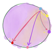

#  Chord-ish

A play implementation of the Chord protocol as described in [this paper](https://pdos.csail.mit.edu/papers/ton:chord/paper-ton.pdf) for use as the membership and failure detection layers for [*Chord-ish DeFiSh*](https://github.com/slin63/chord-dfs).

## Setup

1. `docker-compose build && docker-compose up --scale worker=<num-workers>`
   1. For `num-workers`, it's stable for 3 - 5 workers. You can scale to as many nodes as you want though; if you don't mind Docker eating all your CPU.

## Chord-ish, briefly

You can read all about how Chord-ish works at: [🔌 • chord-ish: implementing a simple membership protocol](https://www.chronicpizza.net/posts/chordish/).

